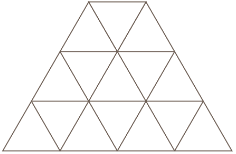

# Trapez
Dostępna pamięć: 64MB
Bajtomirek ułożył z identycznych trójkątów równobocznych trapez. W pierwszej (dolnej) krawędzi znajduje się n boków trójkątów, a w górnej m. Ile łącznie trójkątów zużył Bajtomirek na trapez? Możesz założyć, że zawsze da się ułożyć trapez i że jest on równoramienny.
### Wejście
W pierwszym i jedynym wierszu wejścia znajduje się dwie liczby naturalne n i m – odpowiednio liczba boków trójkątów w dolnej i górnej podstawie trapezu (1 ≤ m < n ≤ 109).
### Wyjście
Jedyny wiersz wyjścia zawiera jedną liczbę całkowitą – odpowiedź na pytanie z zadania.
### Przykład
Wejście
```
4 1
```
Wyjście
```
15
```
### Ilustracja przykładu

